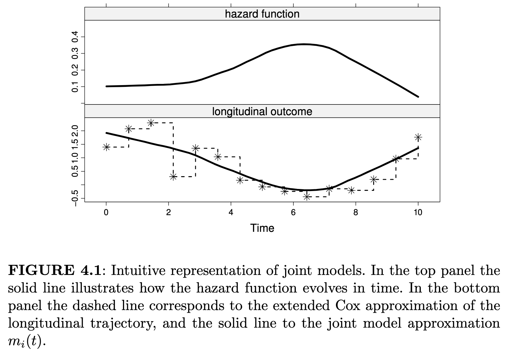

```{r setup, include=FALSE}
library(tidyverse)
library(plotly)
library(nlme)
library(JMbayes2)
library(ggsurvfit)
library(survminer)
library(knitr)
library(gtsummary)
base_dir <- switch(
  Sys.info()["nodename"],
  "togo" = "/home/tvigers/Documents/Data",
  "Tims-MacBook-Air.local" = "/Users/tim/Library/CloudStorage/OneDrive-UW",
  "Tims-Mac-mini.local" = "/Users/tim/Library/CloudStorage/OneDrive-UW",
  "Tims-Mac-Studio.local" = "/Users/tim/Library/CloudStorage/OneDrive-UW",
  "Mac" = "/Users/tim/Library/CloudStorage/OneDrive-UW",
  "Mac-Studio" = "/Users/lpyle/Library/CloudStorage/OneDrive-SharedLibraries-UW",
  "MacBook-Pro-51.local" = "/Users/pylell/Library/CloudStorage/OneDrive-SharedLibraries-UW(2)",
  "Kristens-MacBook-Pro.local" = "/Users/kristenmiller/Library/CloudStorage/OneDrive-UW",
  "twigs" = "/home/tim/Documents/Data",
  "MacBook-Pro-169.local" = "/Users/pylell/Library/CloudStorage/OneDrive-SharedLibraries-UW(2)"
)
data_dir <- switch(
  Sys.info()["nodename"],
  "togo" = "/BDC/Andrea Steck/Advanced CGM and OGTT",
  "Tims-MacBook-Air.local" = "/UWMDI/Andrea Steck/Advanced CGM and OGTT",
  "Tims-Mac-mini.local" = "/UWMDI/Andrea Steck/Advanced CGM and OGTT",
  "Tims-Mac-Studio.local" = "/UWMDI/Andrea Steck/Advanced CGM and OGTT",
  "Mac" = "/UWMDI/Andrea Steck/Advanced CGM and OGTT",
  "Mac-Studio" = "/Tim Vigers - UWMDI/Andrea Steck/Advanced CGM and OGTT",
  "MacBook-Pro-51.local" = "/Tim Vigers - UWMDI/Andrea Steck/Advanced CGM and OGTT",
  "Kristens-MacBook-Pro.local" = "/Tim Vigers's files - UWMDI/Andrea Steck/Advanced CGM and OGTT",
  "twigs" = "/UWMDI/Andrea Steck/Advanced CGM and OGTT",
  "MacBook-Pro-169.local" = "/Tim Vigers - UWMDI/Andrea Steck/Advanced CGM and OGTT"
)
home_dir <- paste0(base_dir, data_dir)
knitr::opts_knit$set(root.dir = home_dir)
set.seed(42)
```

```{r data cleaning}
setwd(home_dir)
set.seed(1017)
# Load data
# See BDC-Code/Andrea Steck/Advanced CGM and OGTT/create_analysis_dataset.R
load("./Data_Clean/analysis_dataset.RData")
# Filter people >= age 30 and those who progressed at their first CGM visit.
# We don't know for sure that the CGM wear happened prior to progression, so
# these people may not be in the risk set.
no_risk <- cgm_surv$ID[which(cgm_surv$EndTime == 0 & cgm_surv$event == 1)]
cgm_lmm <- cgm_lmm |> filter(Age < 45, !ID %in% no_risk)
# Remove TRIALNET
# cgm_lmm <- cgm_lmm |> filter(study != "TRIALNET")
# Scale and center the variables of interest
# cgm_lmm$mean_glucose <- scale(cgm_lmm$mean_glucose)
# cgm_lmm$sd_glucose <- scale(cgm_lmm$sd_glucose)
# cgm_lmm$cv_glucose <- scale(cgm_lmm$cv_glucose)
# cgm_lmm$perc_time_over_140 <- scale(cgm_lmm$perc_time_over_140)
# cgm_lmm$hba1c <- scale(cgm_lmm$hba1c)
# Limit survival group to those included in mixed model DF
cgm_surv <- cgm_surv |> filter(ID %in% cgm_lmm$ID)
# Make a simplified dataset for Andrea to pick participants for examples
newdat <- full_join(cgm_lmm, cgm_surv)
newdat <- newdat |>
  group_by(ID) |>
  select(ID, Group, Age, AgeEndpoint) |>
  summarise(
    BaselineAge = round(first(Age), 1),
    AgeEndpoint = round(unique(AgeEndpoint), 1),
    Group = unique(Group),
    VisitsWithCGM = n()
  )
# Create dataset for testing model AUC, etc.
new_dat = full_join(cgm_lmm, cgm_surv)
```

# Part I: Foundations {background-color="#028090"}

## What is joint modeling?

::: {.fragment}

<div class="stat-box">
A statistical model of two (or more) related outcomes, most often a longitudinal and a time-to-event outcome 
</div>

:::

::: {.columns}
::: {.column width="50%"}

::: {.fragment}
<div class="stat-box" style="margin-top:0.7em;">
<strong>Longitudinal outcome</strong><br>
is tracked over time in the same subjects, also called a <em>repeated measure</em>
</div>

:::

::: {.fragment}
```{r pop-sample-diagram, echo=FALSE, fig.height=4}
# Install and load necessary packages if you haven't already
# install.packages("ggplot2")
# install.packages("lme4")
library(ggplot2)
library(lme4) # Contains the sleepstudy dataset

# Load the example longitudinal data
data(sleepstudy)

# Create a spaghetti plot with an overall trend line
ggplot(data = sleepstudy, aes(x = Days, y = Reaction, group = Subject)) +
  geom_line(color = "gray", alpha = 0.5) + # Individual lines (lightly colored)
  geom_point(color = "gray", alpha = 0.5) + # Individual points (optional)
  geom_smooth(
    aes(group = 1),
    method = "lm",
    color = "blue",
    linewidth = 1.5,
    se = TRUE
  ) + # Overall linear trend
  labs(
    title = "Longitudinal Plot of Reaction Time over Days",
    x = "Days of Sleep Deprivation",
    y = "Reaction Time (ms)"
  ) +
  theme_minimal()
```

:::
::: 

::: {.column width="50%"}

::: {.fragment}
<div class="stat-box" style="margin-top:0.7em;">
<strong>Time-to-event outcome</strong><br>
measures the length of time until an occurrence of an event, also called a <em>survival outcome</em>
</div>

:::

::: {.fragment}

```{r pop-sample-diagram2, echo=FALSE, fig.height=4}
library(survival)
library(survminer)
surv_object_all <- Surv(time = lung$time, event = lung$status == 2)
fit_all <- survfit(surv_object_all ~ 1, data = lung)
# Plot the curve using ggsurvplot for publication-ready plots
ggsurvplot(
  fit_all,
  data = lung,
  title = "Survival Probability of Lung Cancer Patients",
  conf.int = TRUE, # Add confidence intervals
  risk.table = F, # Add the number-at-risk table
  ggtheme = theme_light(), # Use a clean theme,
  legend = "none"
)
```
:::
:::
:::

## Why joint modeling?

<div class="stat-box" style="margin-top:0.7em;">
<strong>Analyzing these outcomes separately introduces bias:</strong><br>

</div>

::: {.fragment}

### Problem 1: Informative Dropout
Patients who experience the event early tend to have worse longitudinal trajectories. Ignoring this creates **selection bias**.

:::

::: {.fragment}

### Problem 2: Measurement Error
Using observed (error-prone) biomarker values as time-varying covariates in a Cox model leads to **attenuation bias** — underestimating the true association.

:::

::: {.fragment}

### Problem 3: Efficiency
Separate models discard information. A joint model **borrows strength** across both submodels, improving parameter estimation efficiency.

:::

## Model Specification

A joint model has two linked submodels:

::: {.fragment}

### Longitudinal Submodel
$$
Y_i(t) = m_i(t) + \varepsilon_i(t), \quad \varepsilon_i(t) \sim \mathcal{N}(0, \sigma^2)
$$
$$
m_i(t) = \mathbf{x}_i^\top(t)\boldsymbol{\beta} + \mathbf{z}_i^\top(t)\mathbf{b}_i, \quad \mathbf{b}_i \sim \mathcal{N}(\mathbf{0}, \mathbf{D})
$$

:::

::: {.fragment}
### Time-to-Event Submodel
$$
h_i(t) = h_0(t) \exp\!\left[\boldsymbol{\gamma}^\top \mathbf{w}_i + \alpha \, m_i(t)\right]
$$

:::

::: {.fragment}
### The Association Parameter
The parameter $\alpha$ **links** the two submodels - it captures the effect of the true (latent) longitudinal trajectory on the hazard of the event.
:::

## Model intuition



## Joint modeling in diabetes research

::: {.fragment}

### Example 1:
Do longitudinal trajectories of HbA1c associate with diabetic retinopathy? (https://doi.org/10.1038/s41598-022-06240-5)

:::

::: {.fragment}

### Example 2:
Does drug response predict the risk of side effects in patients starting T2D therapy? (https://doi.org/10.2147/CLEP.S179555)

:::

::: {.fragment}

### Example 3:
Can daily glucose measures predict preterm birth in women with T1D? (https://doi.org/10.1155/2020/3074532)

:::

# Part II: Our Data {background-color="#028090"}

## Studies

- **ASK**: <u>A</u>utoimmunity <u>S</u>creening for <u>K</u>ids
- **DAISY**: The <u>D</u>iabetes <u>A</u>uto <u>I</u>mmunity <u>S</u>tudy in the <u>Y</u>oung
- **TrialNet** Pathway to Prevention of T1D

## Participant characteristics {.scrollable}

```{r}
#| echo: false
cgm_surv |>
  select(-ID, -event) |>
  mutate(
    Race_Ethn2 = factor(Race_Ethn2, levels = c("NHW", "Other")),
    maxAB_group = factor(
      maxAB_group,
      levels = 2:3,
      labels = c("Single", "Multiple")
    )
  ) |>
  tbl_summary(
    by = Group,
    label = list(
      study = "Study",
      sex = "Sex",
      Race_Ethn2 = "Race/Ethnicity",
      screen_FDR_GP = "FDR Status",
      maxAB_group = "Max. Antibody Status",
      AgeEndpoint = "Age at Progression or Censoring",
      EndTime = "Time to Progression or Censoring"
    )
  ) |>
  add_p() |>
  add_overall() |>
  separate_p_footnotes() |>
  add_stat_label()
```

## Progression by age

- Our time-to-event model was a simple Cox proportional hazards model with age as time and adjusted for sex (p = 0.04).

:::{.fragment}

```{r}
#| echo: false
survfit2(
  Surv(AgeEndpoint, event) ~ sex,
  data = cgm_surv
) |>
  ggsurvfit(type = "risk") +
  labs(
    x = "Age (years)",
    y = "Progression risk"
  ) +
  add_confidence_interval()
```

:::

## Longitudinal model

:::{.fragment}
- We calculated standard summary metrics for each CGM wear (mean sensor glucose, glucose SD, etc.).
:::

:::{.fragment}
- Summary metrics were modeled using a linear mixed effect model with random intercept for participant and random slope.
:::

:::{.fragment}
- CGM wears with age >= 45 were excluded.
:::

::: {.columns}
::: {.column width="50%"}
:::{.fragment}

```{r}
#| echo: false
lme_fit_mean_rs <- lme(
  mean_glucose ~ Age,
  random = ~ Age | ID,
  data = cgm_lmm
)
plot_df <- lme_fit_mean_rs$data
plot_df$pred <- predict(lme_fit_mean_rs)
ggplot(plot_df, aes(x = Age, color = ID)) +
  geom_point(aes(y = mean_glucose), alpha = 0.2) +
  geom_line(aes(y = pred)) +
  ylab("Mean Glucose (mg/dL)") +
  theme_bw() +
  theme(legend.position = "none")
```

:::
:::

::: {.column width="50%"}
:::{.fragment}

```{r}
#| echo: false
lme_fit_sd_rs <- lme(
  sd_glucose ~ Age,
  random = ~ Age | ID,
  data = cgm_lmm
)
plot_df <- lme_fit_sd_rs$data
plot_df$pred <- predict(lme_fit_sd_rs)
ggplot(plot_df, aes(x = Age, color = ID)) +
  geom_point(aes(y = sd_glucose), alpha = 0.2) +
  geom_line(aes(y = pred)) +
  ylab("SD Glucose (mg/dL)") +
  theme_bw() +
  theme(legend.position = "none")
```

:::
:::
:::