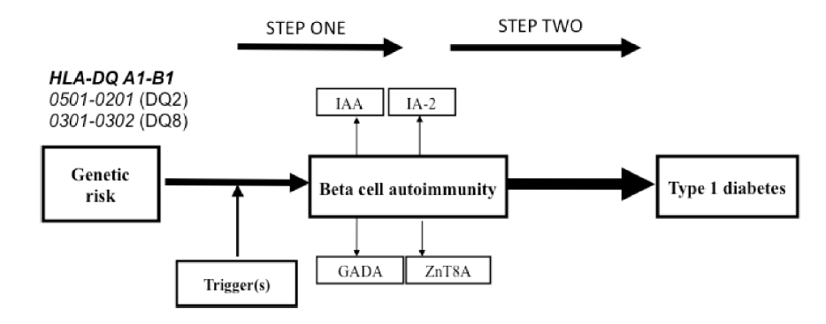
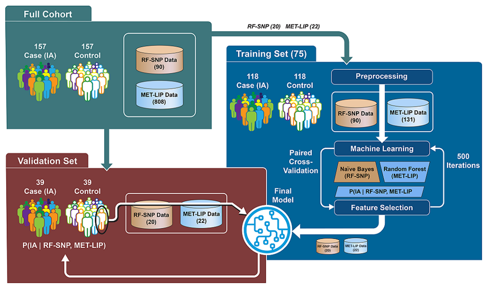

```{r setup, include=FALSE}
knitr::opts_chunk$set(echo = FALSE)

library(base)
```

<style>
div.footnotes {
  position: absolute;
  bottom: 0;
  margin-bottom: 10px;
  width: 80%;
  font-size: 0.6em;
}
</style>

<script src="https://ajax.googleapis.com/ajax/libs/jquery/3.1.1/jquery.min.js"></script>
<script>
$(document).ready(function() {
  $('slide:not(.backdrop):not(.title-slide)').append('<div class=\"footnotes\">');

  $('footnote').each(function(index) {
    var text  = $(this).html();
    var fnNum = (index+1).toString();
    $(this).html(fnNum.sup());

    var footnote   = fnNum + '. ' + text + '<br/>';
    var oldContent = $(this).parents('slide').children('div.footnotes').html();
    var newContent = oldContent + footnote;
    $(this).parents('slide').children('div.footnotes').html(newContent);
  });
});
</script>

<script>
$(document).ready(function() {
  $('slide:not(.backdrop):not(.title-slide)').append('<div class=\"footnotes\">');

  $('footnote_nonum').each(function(index) {
    var text  = $(this).html();
    var fnNum = ("").toString();
    $(this).html(fnNum.sup());

    var footnote   = text + '<br/>';
    var oldContent = $(this).parents('slide').children('div.footnotes').html();
    var newContent = oldContent + footnote;
    $(this).parents('slide').children('div.footnotes').html(newContent);
  });
});
</script>

### Conflict of Interest

I have no current or past relationships with commercial entities.

## Background

### Type 1 diabetes

- Type 1 diabetes (T1D) is an autoimmune disease that leads to destruction of the pancreatic &#x3B2;-cells and loss of insulin production
- T1D requires life-long insulin therapy and is associated with complications including cardiovascular disease, kidney disease, and microvascular complications
- On average, a 20-year-old male loses 11.1 years and a 20-year-old female loses 12.9 years of life expectancy [@livingstone_estimated_2015]
- The global incidence of T1D is increasing by 3-5% annually (ref CDC)

### Type 1 diabetes

- T1D is typically preceded by development of islet autoimmunity (IA), antibodies against the insulin-producing beta cells of the pancreas
- ref: Regnell and Lernmark 2013

<p align="center">
{height=90%, width=90%} 
<p>

### The TEDDY study

- The Environmental Determinants of Diabetes in the Young (TEDDY) study is a multinational study with the following aims (ref Rewers 2018): 
    - Identifying environmental factors triggering IA
    - Identifying biomarkers and predictors of progression to T1D in those with IA
- 8,676 children with increased risk of T1D were enrolled in the US, Germany, Sweden, and Finland    
- Children are evaluated for IA every 3 months until development of T1D or 48 months, after which visits are every 6 months

### Objective

- Our goal was to develop a risk prediction model for IA in TEDDY study participants
- Because the pool of potential biomarkers was large and complex, we planned to evaluate three machine learning (ML) approaches to model selection:
  - An ensemble ML approach
  - DIFAcTO pipeline [@ref]
  - Elastic net regression

## Methods

### Study design

- A nested case-control study was performed in 157 case-control pairs
- Controls were selected from IA-free participants at the same time point for each case, and were matched by clinical center, sex, and family history of T1D
- Potential biomarkers collected include demographics, SNPs, HLA genotypes, dietary exposures, metabolomics, and lipidomics

### Ensemble ML approach

- Training (N=119) and validation (N=39) test sets were created
- Initial screening was performed using paired t-tests
- Multiple ML algorithms (logistic regression, naive Bayes classifier, random forest [RF], support vector machine) were applied with 5-fold cross-validation to evaluate the best algorithm
- RF was applied to the metabolomic and lipidomic data, and a naive Bayes classifier applied to the other data
- Models were merged as the product of the posterior probabilities of each model
- Repeated optimization for feature interpretation was used to identify features that best discriminated children who would develop IA

### Ensemble ML approach

<p align="center">
{height=90%, width=90%} 
<p>

### DIFAcTO pipeline

- Data Integration Flexible to Account for different Types of data and Outcomes was originally published as a computational tool aimed at reducing data dimensionality and integrating various data types (ref Speake)
- Variables were scaled and clustered using Pearson's correlation
- The variable within a cluster with the strongest association with the outcome was selected to represent the cluster
- The minimum within-cluster correlation was selected using cross-validation
- LASSO regression was used to perform model selection on the remaining features

### Elastic net regression

- The elastic net is a regression shrinkage and model selection method that is particularly useful for high-dimensional data with correlated predictors (@Zhou and Hastie)
- Elastic net models are parameterized by $\lambda$, a measure of shrinkage, and $\alpha$, which describes the similarity to ridge and LASSO regression
- The *ensr* package in R (@ref) was used to perform a grid search for $\alpha$ and $\lambda$ values that minimized the cross-validation error
- We chose the smallest model with the cross-validation error that was within 1 SD of the minimum

### Simulation methods

- To further compare the DIFAcTO pipeline and elastic net regression, we applied these methods to a simulated high-dimensional dataset
- We used metabolomic data from the COPD Gene study (@ref) as well as proteomic data from the TODAY study (@ref) to inform our choices of simulation parameters
- We simulated 1000 datasets of each of the following scenarios:
    - 50 or 200 features 
    - 30, 100, 500 samples
- We first generated a random correlation matrix and controlled the sparsity by randomly setting some elements of the correlation matrix to zero, using a probability of a non-zero correlation at 5%

### Simulation methods

- Means were drawn from a $N(1500,830)$ distribution and SDs were drawn from a $U(1,500)$ distribution
- We regressed metabolites on age and simulated $\beta \sim N(0.002, 0.04)$, with $\epsilon \sim N(0,8)$
- We randomly selected features to be included in the simulation model
- We evaluated the performance of DIFAcTO and elastic net by calculating the Jaccard similarity and RMSE vs. the true model

## Results

### TEDDY study results

| Algorithm   | Number of features | Cross-validated AUC |
| ----------- | :----------------: | :-----------------: |
| Ensemble ML | 42                 | 0.74                |
| DIFAcTO     | 4                  | 0.57                |
| Elastic net | 17                 | 0.67                |

- Adipic acid and rs2476601 were selected by all 3 approaches
- Elastic net and the ensemble ML selected rs6679667, rs6897932, and rs7804356

### Simulation results

| Features | Samples | DIFAcTO Jaccard Similarity | EN Jaccard Similarity | DIFAcTO RMSE | EN RMSE | DIFAcTO size | EN size | 
| -------- | ------- | :------------------------: | :-------------------: | :----------: | :-----: | :----------: | :-----: |
| 50       | 30      | 0.06                       | 0.26                  | 20.8         | 3.8     | 7.0          | 14.8    |
| 50       | 100     | 0.04                       | 0.36                  | 24.2         | 6.7     | 5.0          | 12.9    | 
| 50       | 500     | 0.03                       | 0.57                  | 25.0         | 7.8     | 3.8          | 8.6     |
| 200      | 30      | 0.05                       | 0.20                  | 14.3         | 3.0     | 16.0         | 20.5    |  
| 200      | 100     | 0.03                       | 0.32                  | 23.4         | 6.4     | 10.7         | 14.0    |
| 200      | 500     | 0.02                       | 0.52                  | 24.3         | 7.8     | 7.7          | 10.1    |
* True model size was 5 features

### Simulation results

- Comments:
  - EN had higher Jaccard similarity and lower RMSE for all scenarios
  - EN tended to choose larger models
  - As N increased, EN JS decreased but D JS decreased slightly
  - As N increased, RMSE actually tended to increase while model size decreased
  - As P increased, JS decreased and RMSE decreased, while model size increased

### Simulation results

```{r}
readRDS("./plot_pcon_10_N_200_n_500.rds")
```

- 200 features, N=500

## Conclusions

### Conclusions

- The ensemble ML approach had the highest AUC when applied to the TEDDY data, but also selected the largest model
- There was little overlap in the features selected in the TEDDY data by the 3 methods
- When applied to simulated data, elastic net had higher Jaccard similarity with the true model and lower RMSE compared to DIFAcTO, although it selected larger models  
    - Elastic net encourages a "grouping effect" where strong correlated predictors are kept in the model (Zhou and Hastie)
- The DIFAcTO algorithm required significantly longer computational time compared to elastic net

### Limitations and future work

- Simulations
    - We assumed MVN distribution for outcomes, linear model, no interactions
    - We used a random correlation matrix, without structure, although there was not much structure in the COPD Gene data
    - Examination of additional simulation scenarios, including sparsity and number of features in true model
- Further comparison of elastic net and ensemble ML approaches

### Acknowledgments

- We thank the TEDDY study participants and families for providing data and for participation in the study
- Funding from NIDDK, NIAID, NICHD, NIEHS, CDC, JDRF
- The ensemble ML work was performed at Pacific Northwest National Laboratory, operated by Battelle for the DOE

### References
